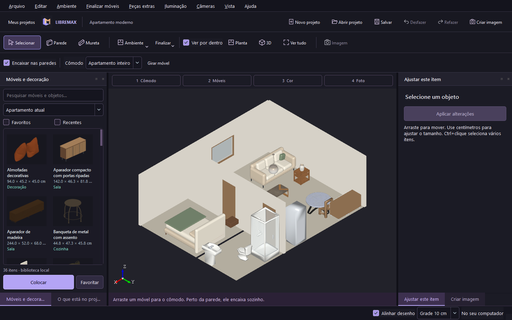

# LibreMax Architect

Editor desktop open source de interiores, com C++20, Qt 6 e OpenCASCADE. Linux é o alvo principal. A implementação é independente e clean-room, usando o VDMax Arquitetos e Decoradores somente como referência pública de capacidades.

**Estado: 0.6.1 em desenvolvimento. Esta entrega ainda não atende à paridade integral da master spec e não é uma release 1.0.** A [master spec](docs/MASTER_SPEC.md) é o requisito de referência. A [matriz de paridade](docs/VDMAX_ARCHITECT_PARITY.md) registra as lacunas por requisito, sem promover testes do kernel a prova de um workflow completo.



A direção visual atual usa grafite neutro, violeta e cobre, com logo próprio, abertura breve e opção para desativar animações. A tela inicial reúne projetos recentes e ações para criar, abrir ou experimentar um apartamento.

A imagem acima é uma captura do programa compilado no Windows, com viewport OpenCASCADE; não é um mockup. Build, testes, interface nativa com Xvfb/Mesa e pacote Debian passaram na [CI Linux](https://github.com/Pepeu2010/libremax-architect/actions/runs/36951914174); hardware gráfico físico permanece sem validação. A instalação do pacote Ubuntu 24.04 em um runner novo passou na [CI dos instaladores](https://github.com/Pepeu2010/libremax-architect/actions/runs/37010283076).

Ampliação atual: [18 novos modelos contemporâneos e evidência](docs/CATALOG_EXPANSION.md). No host de desenvolvimento, `Abrir LibreMax.cmd` abre a build atualizada.

Já disponível neste ciclo:

- Desenhar cadeias de paredes e muretas; criar ambiente retangular com piso e forro.
- Inserir portas e janelas com recortes booleanos reais, vinculadas à parede.
- Biblioteca local SQLite/FTS5 com busca sem acentos, filtros, favoritos e recentes; 115 itens: 25 receitas próprias, porta/janela, 52 modelos 3D Kenney, 24 Poly Haven e 12 designs contemporâneos LibreMax CC0. O filtro **Apartamento atual** reúne 36 modelos, incluindo sofás, cama queen, móveis ripados, espelho, banquetas e decoração. Os modelos Poly Haven preservam mapas/UVs; os designs originais usam acabamentos procedurais no Cycles.
- Tutorial de 15 capítulos na primeira abertura, reaberto em Ajuda ou na tela inicial. Biblioteca de projetos locais com imagem, nome, data e aviso de arquivo movido.
- Catálogo carregado ao entrar no editor; busca sem carregar todas as malhas, miniaturas em dois workers e cache de geometria para evitar reconstruir sólidos inalterados. Essas melhorias não constituem benchmark de apartamentos grandes.
- Arrastar móveis em planta/3D com orientação pela parede, encaixe em cantos/vizinhos, prévia verde/vermelha e bloqueio de posição ocupada. Objetos pequenos acompanham o topo do móvel e o novo pendente acompanha a altura do cômodo. Arrastar itens existentes confirma uma alteração reversível.
- Duplo clique aguarda escolher o lugar; R gira a prévia, Esc cancela. Editar medidas comuns em centímetros, com vírgula e expressões; coordenadas técnicas ficam nos ajustes adicionais.
- Criar cômodos adjacentes em metros, reaproveitar paredes coincidentes e abrir um apartamento com sala/cozinha, quarto e banheiro.
- Inspecionar sólidos em planta superior e 3D; orbit, pan, zoom, seleção, ocultação, bloqueio, duplicação e espelhamento de móveis.
- Gerar tampos, rodatampos, rodapés, rodaforros, painel lateral e envelopamento sobre fontes associadas. A cobertura ainda é restrita aos casos documentados em [AUTOMATIONS](docs/AUTOMATIONS.md).
- Importar DXF ASCII com layers e unidade; incorporar texturas JPG/PNG ao projeto.
- Salvar/abrir `.lmx` ZIP versionado, backup `.bak`, undo/redo, autosave configurável (1–60 minutos) e recuperação de versões locais.
- Criar câmeras e luzes point/spot/area; renderizar com Blender/Cycles em processo separado, PNG/JPEG, presets, seleção de câmera, exposição, luz ambiente, denoise e descoberta GPU com fallback CPU.
- Workspace escuro de render com zoom/pan, Ajustar, 1:1 e exportação de cópia PNG/JPEG; materiais PBR incorporados de madeira/pedra, céu natural/sol e câmera fotográfica no Cycles.

Faltam recursos essenciais: detecção de regiões, junções avançadas, cotas, snap completo de desenho, escadas L/U, geometria livre/perfis/sancas, importadores 3D pela interface, atualização remota de packs, catálogo fotográfico extenso, agrupamento/gizmos, galeria/fila de renders persistentes. A coleção Kenney é estilizada; a nova coleção detalhada não cobre todos os móveis de um apartamento. O encaixe usa volumes aproximados. Veja [limites de montagem](docs/ASSEMBLY.md) e [ROADMAP](docs/ROADMAP.md).

Para apresentação, abra `examples/cozinha.lmx`, escolha **Céu natural** e a qualidade desejada no Render. Em outros projetos, **Ativar texturas reais** incorpora mapas de carvalho e pedra. Exposição e direção do sol são editáveis; abertura e foco ficam nas propriedades da câmera. [Guia de render](docs/RENDERING.md).

## Baixar e instalar

Abra [INSTALADOR](INSTALADOR/README.md) e escolha [Windows](INSTALADOR/windows/README.md) ou [Linux](INSTALADOR/linux/README.md). Os arquivos `.exe` e `.deb` ficam nas [Releases](https://github.com/Pepeu2010/libremax-architect/releases). É preciso acesso ao repositório privado.

O instalador inclui modelos, texturas e exemplos. Para fotos realistas, instale Blender 5.2 LTS+ separadamente e selecione o executável no painel Render. A versão é uma prévia em desenvolvimento.

## Compilar e executar

Ubuntu/Mint/Debian com Qt ≥ 6.4:

```bash
bash scripts/bootstrap.sh
bash scripts/build.sh
bash scripts/test.sh
bash scripts/run.sh
```

A distribuição inicial usa instalador Windows e `.deb` para Ubuntu 24.04/base do Mint 22. AppImage ainda não está disponível. O bootstrap abaixo instala dependências de desenvolvimento e não instala Blender. Escolha o executável Blender no painel Render; o usuário não precisa editar o projeto nele. [Instruções e limites de plataforma](docs/BUILDING.md).

No host Windows desta sessão:

```powershell
./scripts/run-windows.ps1
```

## Fluxo de uso atual

**1 Cômodo → 2 Móveis → 3 Cor → 4 Foto.** Escolha medidas e posição do cômodo, arraste o móvel, ajuste tamanho/acabamento e use **Preparar câmera do cômodo** para gerar a imagem. Na tela inicial, **Experimentar apartamento** abre a versão com modelos detalhados; o arquivo também está em `examples/apartamento-moderno.lmx`. A coleção anterior permanece em `examples/apartamento.lmx`. [Guia de montagem](docs/ASSEMBLY.md).

O checkbox **Ver por dentro** oculta o forro no viewport e duas orientações de paredes na vista isométrica, facilitando ver o interior. Isso não altera o documento nem o render. Ainda não acompanha automaticamente a órbita.

Em Arquivo, configure o intervalo de autosave ou recupere versões anteriores. São mantidas cinco cópias por projeto; arquivos corrompidos são ignorados e preservados. A recuperação após encerramento forçado foi testada neste host.

| Atalho | Ação |
|---|---|
| Ctrl+N / Ctrl+O | Novo / abrir |
| Ctrl+S / Ctrl+Shift+S | Salvar / salvar como |
| Ctrl+Z / Ctrl+Shift+Z | Desfazer / refazer |
| Ctrl+D / Delete | Duplicar / excluir seleção |
| Ctrl+R | Girar móvel selecionado |
| R / Esc durante colocação por clique | Girar prévia / cancelar |
| 1 / 3 | Planta superior / isométrica |
| F | Enquadrar projeto |
| Esc / clique direito durante parede | Encerrar cadeia de desenho |
| Botão do meio / roda | Pan / zoom |
| Botão direito em 3D | Orbit |

[Montagem](docs/ASSEMBLY.md), [pesquisa oficial VDMax](docs/VDMAX_RESEARCH_04.md), [biblioteca](docs/LIBRARY.md), [materiais](docs/MATERIALS.md), [render](docs/RENDERING.md), [formato do projeto](docs/PROJECT_FORMAT.md), [recuperação](docs/RECOVERY.md), [testes](docs/TEST_REPORT.md), [entrega atual](docs/CYCLE_04.md) e [auditoria das referências visuais](docs/VISUAL_REFERENCE_AUDIT.md).

Código: GPL-3.0-or-later. Receitas próprias, modelos Kenney e modelos Poly Haven: CC0-1.0, com fontes em [starter-models](starter-models/README.md). Mapas PBR Poly Haven: CC0-1.0, com proveniência em [starter-materials](starter-materials/README.md). [Licenças de dependências](docs/THIRD_PARTY.md). Contribuições devem incluir fluxo integrado e teste; [CONTRIBUTING](docs/CONTRIBUTING.md). Evidências desta entrega: [CYCLE_06](docs/CYCLE_06.md).
