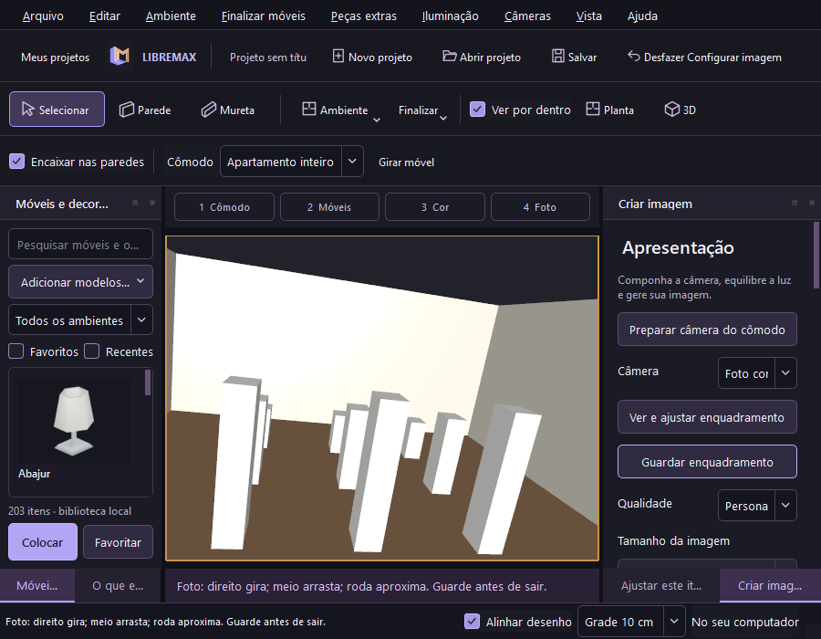

# Enquadrar a foto — fonte 0.17

1. Escolha o cômodo e use **Preparar câmera do cômodo** em **4 Foto**.
2. Escolha a câmera e o tamanho da imagem. **Ver e ajustar enquadramento** abre a vista dessa câmera.
3. A moldura cobre a área da foto. Botão direito gira; botão do meio arrasta; a roda aproxima ou afasta.
4. **Guardar enquadramento** confirma uma alteração reversível. **Enviar para renderizar** também guarda o ajuste antes de copiar a cena para a fila.
5. Use **Desfazer** para recuperar a câmera anterior. Esc, Planta, 3D ou Ver tudo retornam à edição; guarde antes de sair da vista da câmera.

A moldura acompanha paisagem, retrato, quadrado e tamanhos personalizados.
Redimensionar a janela conserva a composição. A iluminação da tela continua
sendo uma prévia simples; materiais, sombras e reflexos da foto são calculados
pelo Cycles. O enquadramento coincide, mas as cores da edição não representam
o resultado fotográfico final.

Nos ajustes avançados da câmera, lente, largura do sensor, deslocamentos
horizontal/vertical e distâncias de recorte acompanham o arquivo `.lmx`.
A orientação vertical também é guardada ao girar a câmera pelo mouse, preservando
a inclinação da foto. A posição e o alvo usam milímetros internamente; a interface
conserva as unidades indicadas em cada controle. Câmeras ou conjuntos bloqueados
precisam ser desbloqueados para guardar mudanças.



## Verificação reproduzível

```powershell
./build-render/next/libremax-architect.exe --camera-smoke build-render/camera-evidence --blender ./build-bundled/runtime-verified/blender.exe
```

O teste abre a janela nativa, mede nove pontos em quatro formatos e compara
a projeção contínua do OpenCASCADE com o modelo persistente. Um segundo processo
usa `bpy_extras.object_utils.world_to_camera_view` do próprio Blender para verificar
os mesmos pontos, lente, sensor, deslocamento, inclinação e recorte.

Também exercita botões visíveis na janela de 900 pixels, roda, arrasto, giro,
guardar, histórico, arquivo único e envio pela interface. Quatro imagens verificam
os formatos; uma quinta verifica o envio com enquadramento ainda pendente.
As imagens e relatórios ficam na pasta indicada. A CI executa o teste com
Blender 4.5.9 e 5.2.1 e nos pacotes instalados Windows/Ubuntu.

Essa cena controlada não comprova todas as configurações gráficas, equivalência
fotográfica ao VDMax, navegação a pé nem edição com gizmos. O teste físico
i3-6006U/HD 520/8 GB continua pendente.
