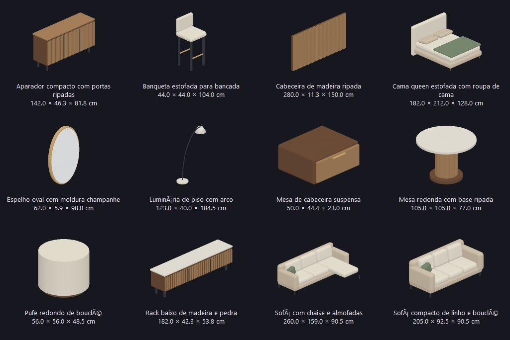
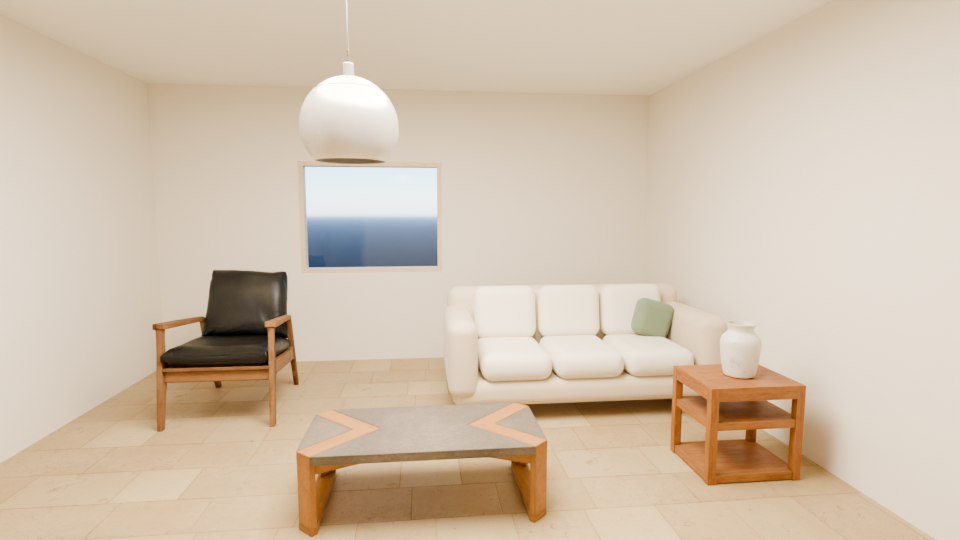

# Ampliação contemporânea do catálogo

Entrega de desenvolvimento em 01/10/2026, mantendo a versão 0.6.0. Acrescenta **18 modelos**: 12 designs originais LibreMax e seis assets Poly Haven CC0. O catálogo completo soma **115 itens**, com 88 modelos prontos. O filtro **Apartamento atual** reúne 36 modelos.

## Modelos acrescentados

Os designs originais incluem sofá compacto de 2,05 m, sofá com chaise, cama queen com almofadas e roupa de cama, cabeceira ripada, mesa de cabeceira suspensa, aparador compacto, rack baixo, mesa redonda com base ripada, banqueta estofada, pufe, espelho oval e luminária de piso com arco. São malhas com curvas, bordas arredondadas e materiais separados, sem reproduzir móveis de fabricantes.



Os seis assets Poly Haven acrescentam suculenta em vaso, mesa de jantar redonda, duas banquetas metálicas, cesto de fibras naturais e mesa de apoio alta. [Fontes, hashes e autores](../starter-models/modern-provenance.json). O script de preparação verifica os arquivos originais; as licenças e os limites estão em [starter-models](../starter-models/README.md).

As medidas são sugeridas ou obtidas da malha, sem certificação de produto. A estante `steel_frame_shelves_01` tinha escala incompatível com apartamentos e agora inicia com 900 × 411,8 × 1.755,4 mm. Projetos existentes mantêm as medidas que já salvaram.

## Uso no app

Biblioteca → **Apartamento atual**, ou busca por nome. Sofás e cama ficam no piso. Cabeceira, mesa suspensa e espelho exigem parede. A mesa suspensa inicia a 45 cm; o espelho, a 95 cm. Os modelos usados e seus materiais ficam incorporados no arquivo `.lmx`. A coleção funciona sem downloads em runtime.

**Experimentar apartamento** agora usa o sofá, a cama queen e a mesa suspensa originais. Luminárias são geometria decorativa; a fonte de luz continua sendo adicionada em Iluminação. Escalar um móvel altera também seus detalhes internos; não é modelagem paramétrica desses componentes.

Os 36 modelos detalhados e seus 84 mapas preparados somam 56,37 MiB, dos quais 16,41 MiB são malhas originais novas. O catálogo é carregado por metadados; inserir incorpora apenas os modelos usados. O limite de assets do projeto continua em 48 MiB. A expansão não comprova desempenho em apartamentos grandes.

## Qualidade das prévias e render

As miniaturas agora resolvem profundidade por pixel e interpolam as normais. Isso elimina triângulos do verso desenhados por cima de sofás, mesas e espelhos. Usam dois workers, supersampling e cache versionado; não abrem um contexto OpenGL por miniatura. São prévias geométricas, sem reflexos ou mapas PBR completos.



Render executado com Blender 5.2.1 LTS/Cycles CPU, 960×540, 64 samples, denoise e céu natural. O render real passou; falha deliberada sem câmera preservou a imagem anterior. Esse resultado valida o pipeline e o sofá mostrado, não todos os modelos em renders individuais, hardware GPU ou fidelidade a uma fotografia.

## Verificação

Build Release Windows com Qt 6.11.2/OpenCASCADE 7.9.3. **28 casos / 1.706 assertions** passaram. Cobertura inclui as 24 malhas Poly Haven, os 12 designs originais, UVs/normais, mapas, hashes, categorias, portabilidade, montagens na parede e uma regressão de superfícies cruzadas que exige ocultação por pixel.

Smoke nativo passou com 36 miniaturas e arraste real de sofá, cama, espelho e mesa suspensa. Também passou a regressão de montagem com 115 miniaturas, interface a 900 px, tutorial/home e recuperação após encerramento forçado. Relatórios locais em `build-catalog/*-report.txt`. Build de verificação usa uma cópia do commit e apenas as mudanças do catálogo, preservando trabalhos em andamento no render e a versão anterior aberta pelo usuário.

```powershell
./build-catalog/bin/libremax-architect.exe --modern-smoke build-catalog/modern-evidence
ctest --test-dir build-catalog/bin --output-on-failure -V
```

No host de desenvolvimento, **Abrir LibreMax.cmd** usa a build nova; salvar e fechar a versão antiga antes de reabrir permite carregar o catálogo atualizado. Não é instalador portátil. Paridade integral, fila/galeria de renders, diagnóstico GPU, HDRI/EXR e as demais lacunas da master spec continuam em desenvolvimento.

Reprodução independente em Blender 5.2.1: as 12 malhas originais, o catálogo e a proveniência foram gerados novamente em outra pasta. Os 14 arquivos coincidiram byte a byte. A verificação detectou e corrigiu uma conversão de codificação no catálogo; buscas sem acentos e o filtro Decoração agora têm regressão explícita.

**CI Linux aprovada:** implementação `ae0fe5b5f4e2e0334e4d93f86d238f3f2fc777af`, [execução 36951914174](https://github.com/Pepeu2010/libremax-architect/actions/runs/36951914174), Ubuntu 24.04. Build, core, formatador, UI/montagem/modelos/tutorial/recuperação com Xvfb/Mesa e pacote Debian passaram. A CI não executa render Cycles no Linux nem comprova GPU física ou instalação limpa.
