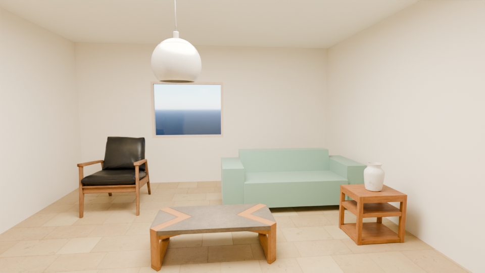
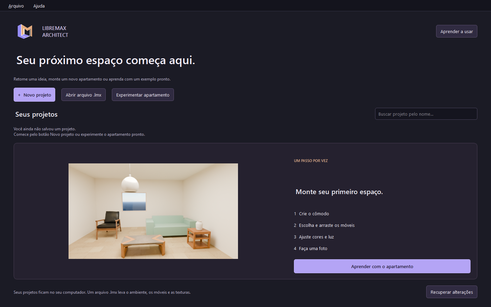

# LibreMax 0.6 — modelos detalhados e primeira abertura

Entrega de desenvolvimento em 01/10/2026. Mantém C++20/Qt6/OpenCASCADE e o render automático por QProcess/Cycles. Não é aceitação da master spec nem comprovação de superioridade ao VDMax.

## Modelos para apartamentos atuais

O catálogo soma 97 itens, com 70 modelos prontos: 52 Kenney anteriores e 18 novos Poly Haven CC0. A coleção **Apartamento atual** inclui duas poltronas, duas estantes, duas mesas de centro, aparador, mesa e cadeiras de varanda, cadeira de jantar, mesa redonda de mármore, mesa lateral, gaveteiro, escrivaninha, duas luminárias, dois vasos e almofadas. São malhas reais; não são caixas com nomes novos.

Originais glTF de 1K tiveram integridade verificada. A conversão preserva transformações, UVs e normais; 66 mapas de cor, rugosidade e normal são distribuídos em PNG até 512 px. Modelos e mapas preparados somam 31,12 MiB. Inserir carrega e incorpora apenas os assets usados; outra cópia preserva acabamentos já editados. O `.lmx` leva esses dados sem depender do catálogo instalado. [Proveniência e limites](../starter-models/README.md).

O novo pendente acompanha a altura do cômodo. Vasos e objetos pequenos podem ficar sobre o topo de outro móvel. Colisão continua baseada em volumes aproximados; não simula encaixe fino nas prateleiras ou entre almofadas. A luminária é geometria decorativa; a fonte de luz é adicionada em Iluminação.




Render: Blender 5.2.1 LTS, Cycles CPU, denoise, 960×540/64 samples, céu natural e mapas incorporados. O Blender informou salvamento aos 55,969 s; isso não mede preparação e cópia da imagem. A poltrona, mesa, luminária, vaso e mesa lateral são da coleção nova. O sofá ainda é Kenney estilizado. O resultado não é uma fotografia nem validação de render Final 1080p/4K.

## Abertura e interface

Tema grafite/violeta/cobre, logo gerado com a ferramenta integrada, abertura de 700 ms com opção de desativar animações e tutorial de 15 capítulos na primeira execução. O tutorial é um guia de navegação com texto e botões; não destaca controles interativamente na cena. Pode ser reaberto em Ajuda.

A tela inicial oferece Novo projeto, Abrir `.lmx`, Experimentar apartamento e biblioteca local dos últimos 100 arquivos. Capas são capturas reais do viewport. Projetos movidos recebem aviso; o índice não é uma cópia de segurança nem parte essencial do arquivo de projeto. Falha de índice deixa a abertura manual disponível. Nenhum projeto é publicado automaticamente.



## Desempenho

Busca da interface consulta metadados sem carregar todas as malhas; entrada tem debounce de 180 ms. Miniaturas e leitura dos modelos usam workers, com cache de payload limitado a 48 MiB. O viewport reutiliza geometria e apresentações inalteradas; a prévia de arraste reaproveita sua geometria e muda a transformação. Paredes e aberturas são invalidadas conjuntamente; automações dependem das fontes.

Na cena de cozinha usada pelo teste, montar o cache pela primeira vez levou 111,726 ms e reutilizá-lo sem mudanças levou 0,2029 ms. São amostras de uma cena pequena, executadas junto a outros testes. Não significam melhoria equivalente de FPS ou do aplicativo inteiro. O construtor da tela inicial levou 181 ms no smoke; isso exclui inicialização de Qt/DLLs. Blender usa prioridade reduzida e até oito threads CPU, deixando margem para o editor.

## Evidência executada

Build Release Windows/UCRT64, Qt 6.11.2, GCC 16.2, OpenCASCADE 7.9.3. Core: 26 casos/1.461 assertions aprovados. Valida todos os modelos novos, UVs/normais, hashes, mapas incorporados, roundtrip, dados adulterados, preservação de acabamentos, posicionamento no teto, índice de projetos e invalidação de cache.

Smoke nativo verifica catálogo/filtro/miniaturas, colocação de modelo novo na parede, vaso sobre mesa, pendente no teto, undo/redo e arquivo de exemplo reaberto. Regressão de montagem e interface verifica 97 miniaturas, arrasto em planta/3D, bloqueio externo, janela associada, expressões em cm e painéis a 900 px. Primeira abertura verifica logo, os 15 capítulos, novo cômodo, salvamento `.lmx`, biblioteca retomada em nova janela e home a 900 px. Render real passou e falha deliberada sem câmera preservou a imagem anterior.

Comandos neste host:

```powershell
$env:PATH = "$env:USERPROFILE\.codex\tmp\lmx-tools\msys64\ucrt64\bin;$env:PATH"
cmake --build build-modern -j3
ctest --test-dir build-modern --output-on-failure -V
./build-modern/libremax-architect.exe --modern-smoke build-modern/modern-evidence
./build-modern/libremax-architect.exe --assembly-smoke build-modern/assembly-evidence
./build-modern/libremax-architect.exe --experience-smoke build-modern/experience-evidence
./build-modern/libremax-architect.exe --ui-smoke build-modern/ui-evidence
./build-modern/libremax-architect.exe --recovery-smoke
./build-modern/libremax-architect.exe --render-smoke build-modern/modern-render --render-project examples/apartamento-moderno.lmx --render-size 960x540 --render-samples 64 --blender 'C:/Program Files/Blender Foundation/Blender 5.2/blender.exe'
```

Logs são locais em `build-modern/*-report.txt`. A CI Linux executa core, formatador, smokes de interface/montagem/modelos/primeira abertura/recuperação e empacotamento Debian. Configurar CI não prova aprovação; verificar o resultado do commit antes de declarar suporte Linux.

**CI Linux aprovada:** implementação `34c3f80a96211b15c847522f513ad469b6137a57`, [execução 36947008639](https://github.com/Pepeu2010/libremax-architect/actions/runs/36947008639), Ubuntu 24.04, Xvfb/Mesa. Build, core, formatador, UI, montagem, coleção moderna, primeira abertura e recuperação passaram; CPack gerou `libremax-architect-0.6.0-Linux.deb`. A criação do pacote não testa instalação em máquina limpa nem drivers físicos. A correção mantém o construtor de textura compatível com OpenCASCADE 7.6 e 7.9.

## Gates ainda abertos

Catálogo extenso, importação de modelos pela interface, avaliação de memória/FPS em cenas grandes, arraste manual prolongado e QA com diferentes monitores/hardware. A arquitetura completa de render pedida continua em desenvolvimento: fila serial/galeria persistente, presets Rápido/Normal/Final/Personalizado com bounces próprios, diagnóstico/versionamento completo, fallback de falha GPU, HDRI, LED, emissão, EXR e recuperação de jobs não estão concluídos nesta entrega. Não há prova de HIP/RX7600 Linux, NVIDIA OptiX, Intel oneAPI ou equivalência ao enquadramento fotográfico da viewport.
