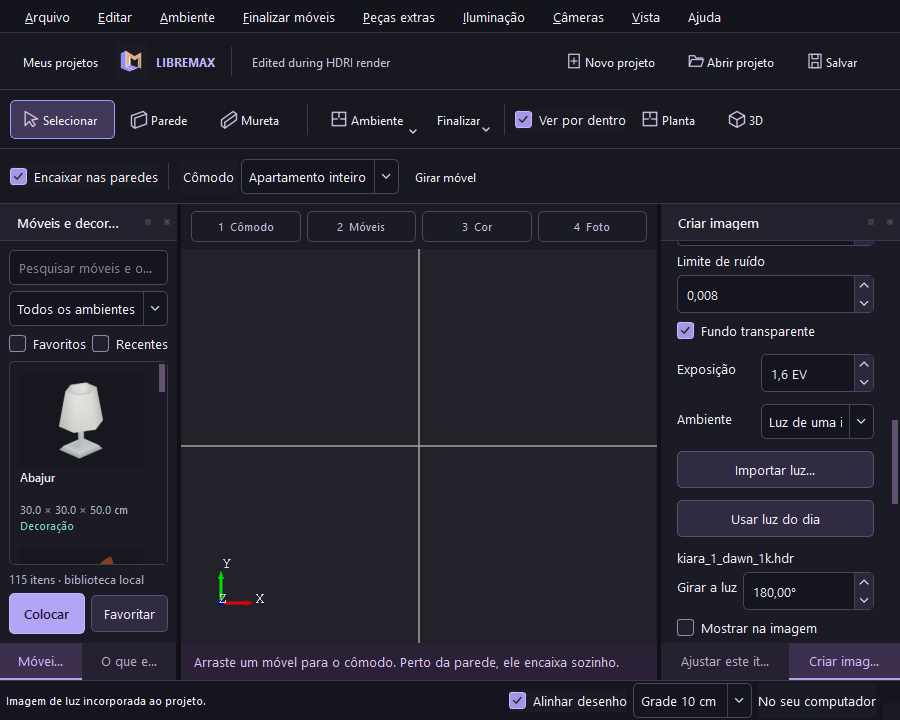
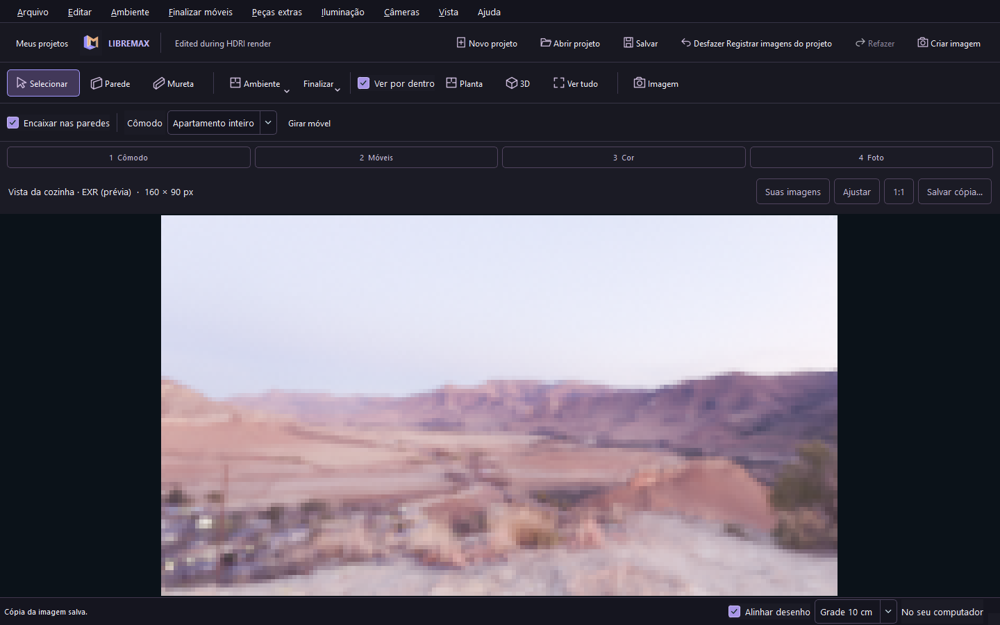
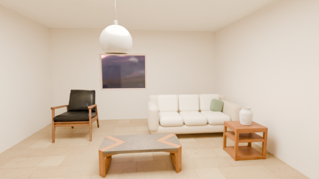

# Luz de ambiente e imagens EXR

No painel Render, escolha **Usar luz do dia** para incorporar o panorama incluído ou **Importar luz…** para selecionar um `.hdr`/`.exr`. A importação lê e valida a imagem em um worker. O nome, a rotação, a intensidade e **Mostrar na imagem** ficam no projeto. Depois de salvar, não é necessário manter o arquivo original. [Formato do projeto v2](PROJECT_FORMAT.md).

O ambiente HDRI ilumina a cena e aparece em reflexos. Desmarcar **Mostrar na imagem** troca somente o fundo visto pela câmera por uma cor sólida. A iluminação e os reflexos continuam usando o panorama. **Fundo transparente**, em Personalizado, gera alpha em PNG/EXR. JPEG desativa transparência. O panorama incluído é [Kiara 1 Dawn / Poly Haven, CC0](../starter-environments/README.md).

Em **Personalizado**, escolha **EXR** quando precisar editar a luz em outro programa. Cycles grava OpenEXR de imagem única, RGBA, float de 32 bits, compressão ZIP, em espaço linear. A prévia PNG usa o mesmo Render Result e o perfil AgX do aplicativo. A galeria abre a prévia; **Salvar cópia…** preserva o EXR original. Exportar PNG/JPEG pelo visualizador exporta a prévia exibida.

`publishRender` valida dimensões e decodifica a imagem fora da thread da interface. Grava a prévia com nome derivado de SHA256 e depois publica o original por QSaveFile. Falha antes da publicação preserva o arquivo anterior e remove apenas a nova prévia desta tentativa. O registro da fila conserva o nome da prévia para reabertura. Resultados e prévias ficam na biblioteca local de renders; não são incorporados ao `.lmx`.

O limite de entrada HDRI é 64 MiB / 16 milhões de pixels; prefira panoramas 1K–4K. EXR deep, multipart e imagens sem RGB em ponto flutuante são recusados. A validação do resultado permite até 8192 × 8192 / 512 MiB; esse limite não é uma garantia de memória ou desempenho para renders grandes. Desfoque de HDRI ainda não está implementado.

O teste `--environment-smoke <pasta> --blender <executável>` usa a interface nativa e Cycles real: importa o panorama incluído, salva/reabre v2, envia quatro renders enquanto edita, compara pixels de rotações diferentes, verifica fundo oculto e alpha, decodifica os EXR originais, reabre o histórico/prévia e salva uma cópia EXR pelo diálogo nativo. A imagem de teste é somente um panorama, para isolar essas condições; não demonstra a qualidade final de um apartamento.

## Evidência Windows

Build Release 0.8.0, Qt 6.11.2/OpenCASCADE 7.9.3, Blender 5.2.1 LTS. **34 casos / 1.829 assertions** no núcleo passaram. Um HDRI sintético válido de 50 MiB também foi salvo e reaberto com os modelos e texturas do apartamento preservados. O fluxo nativo concluiu quatro renders CPU 160 × 90 / oito amostras: EXR com rotações 0°/180°, PNG com panorama oculto e PNG transparente. Diferença média do canal vermelho entre as rotações: **30,2547/255**. Os EXR tiveram pico RGB linear **1,9871** e **92,3523**; seus canais R/G/B/A foram conferidos como FLOAT de 32 bits. A cópia feita por Salvar cópia na galeria corresponde aos bytes do original.

A reabertura da fila preservou as prévias e os snapshots conservaram o estado anterior à edição. A janela de 900 pixels teve viewport/conteúdo de 229 pixels e rolagem horizontal zero. Os testes de UI, montagem, modelos modernos, tutorial de 15 capítulos, recuperação após encerramento forçado e fila de cinco câmeras também passaram. Não é um benchmark de cenas grandes. Linux e os instaladores desta versão ainda precisam da CI; os instaladores publicados continuam na prévia 0.7.0.

Também passou um render do apartamento moderno com o panorama incorporado, 640 × 360 / 32 amostras, na **AMD Radeon RX 7600 / HIP**, Blender 5.2.1 LTS, sem fallback CPU. O teste usa o apartamento existente e um container de aceitação que incorpora o mesmo HDRI validado pela interface. Uma falha posterior de câmera preservou o SHA256 da imagem: `2a49af242b9068baaf33b0cb7c6198be63d18445fae664df09ca4fedcc73779c`. É uma prévia pequena; não comprova qualidade Final 4K ou superioridade sobre outro produto.

A [CI Ubuntu 24.04](https://github.com/Pepeu2010/libremax-architect/actions/runs/37089024012), commit `ed2e007`, também passou com Qt 6.4 e OpenEXR 3.1. Os quatro renders reais tiveram diferença média de rotação 30,2549/255 e picos EXR 1,98709 / 92,3524. A fila, os pixels transparentes, a cópia EXR, a galeria e os smokes nativos passaram. Isso verifica CPU/Mesa/Xvfb; não comprova GPUs físicas Linux.
