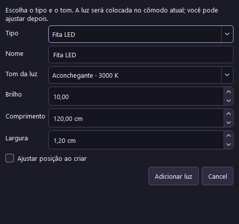
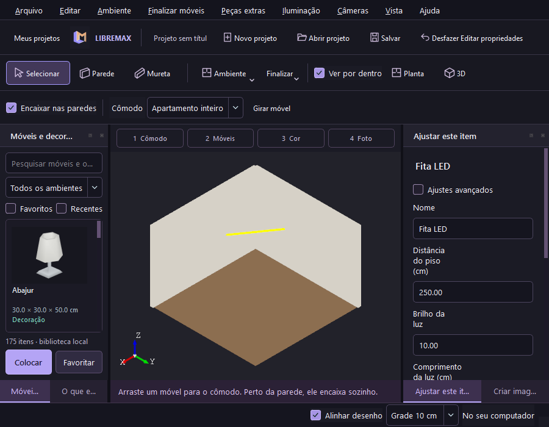
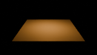
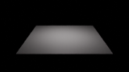

# Iluminação nativa — fontes 0.10

Em **Iluminação → Nova luz**, escolha spot, fita LED, painel de luz, ponto ou sol. A luz começa no centro do cômodo atual, próxima do teto. A posição pode ser ajustada ao criar ou nas propriedades. O alvo inicial fica abaixo da fonte; direção/alvo e giro ficam nos ajustes avançados. Se não houver cômodo, usa a posição inicial do editor.

Escolha Quente (2700 K), Aconchegante (3000 K), Neutra (4000 K), Luz do dia (5000 K), Fria (6500 K), Outra temperatura (1000–12000 K) ou Cor escolhida. Kelvin usa a conversão nativa do Blender, conferida na API do Blender 5.2.1 instalado; a fita LED usa o mesmo RGB linear do motor. [API oficial de luz](https://docs.blender.org/api/5.3/bpy.types.Light.html). O manual diferencia potência luminosa radiométrica do consumo elétrico da lâmpada: [luzes no Blender](https://docs.blender.org/manual/en/dev/render/lights/light_object.html).

**Brilho** controla a intensidade na imagem; não é o consumo elétrico de uma lâmpada comercial. Área/ponto/spot usam a potência radiométrica do Cycles; sol usa irradiância. LED usa fluxo radiométrico dividido pela área e por pi. Os valores iniciais são sugestões, ajustáveis pela prévia; não substituem um cálculo luminotécnico de projeto executivo.

| Tipo | Conversão real | Controles |
|---|---|---|
| Ponto | POINT | Brilho, cor/Kelvin e raio em centímetros |
| Spot | SPOT | Brilho, cor/Kelvin, raio, ângulo e suavidade do feixe |
| Painel | AREA | Retângulo/redonda/quadrada, comprimento e largura, alvo e giro |
| LED | Uma malha plana emissiva contínua | Comprimento, largura, brilho, cor/Kelvin, alvo e giro |
| Sol | SUN | Intensidade, cor/Kelvin, ângulo de sombra e direção |

LED emite apenas pela frente, orientada para o alvo; o verso absorve luz. Não é uma coleção de pontos, nem uma imagem simulando brilho. São quatro vértices e uma face. O script do tradutor acompanha o instalador e cada cópia de render na fila, preservando a repetição do pedido. As luminárias decorativas do catálogo continuam separadas das fontes de luz.

Os marcadores amarelos são auxiliares selecionáveis do editor; não entram na malha exportada nem substituem a iluminação da foto. O painel estreito coloca rótulos acima dos controles, com rolagem vertical. Os ajustes passam pelo histórico de Desfazer/Refazer.

## Projeto portátil e compatibilidade

A nova iluminação exige `.lmx` versão **3**, para impedir que versões antigas abram Kelvin/LED sem reproduzir o resultado. A promoção acontece ao criar ou editar uma luz. Use **Salvar como** para manter uma cópia em arquivo separado. Abra projetos v1/v2 normalmente. HDRI, EXR e snapshots mantêm v3 sem rebaixá-la para v2. Abra arquivos v3 no LibreMax 0.10+; versões anteriores recusam o formato. Não existe conversão automática de volta para versões antigas.

## Evidência

Windows Release: **37 testes / 2.233 verificações** passaram. O teste nativo passou com cinco diálogos de criação, edição Kelvin/medidas, raio/ângulo/formato/giro, undo/redo, layout de 900 pixels e projeto v3 salvo/reaberto. Projetos antigos com direção de luz nula continuam aceitos; o editor e o Cycles usam a direção vertical para baixo nesse caso.

O fluxo pela interface produziu **sete imagens reais Cycles CPU**, 160 × 90 / 16 amostras, no Blender 5.2.1 LTS: LED 3000 K, LED 6500 K, LED desligado, ponto, spot, área retangular e sol. Os descritores vieram dos objetos reais do Blender. Raio de 7 cm virou 0,07 m; painel 120 × 35 cm virou 1,2 × 0,35 m; sombra do sol 0,75 grau virou aproximadamente 0,01309 radiano. O último render foi EXR com prévia integrada.

Na cena controlada, a média RGB foi LED quente **34,01 / 22,30 / 8,56**, LED frio **26,06 / 25,33 / 25,42**, e LED desligado **0,084 / 0,084 / 0,084**. A comparação prova emissão e alteração da cor refletida. Não mede a qualidade de apresentação de um apartamento nem superioridade frente a concorrentes.

Continuar editando a temperatura durante os renders preservou os snapshots originais. Os renders v3 e EXR permaneceram v3. Resultados locais: `build-lighting/lighting-release-report.txt` e `build-lighting/native-release`.

O mesmo projeto LED produziu uma imagem 320 × 180 / 16 amostras pelo pipeline QProcess na RX 7600 deste Windows. O Blender confirmou GPU/HIP sem fallback; uma falha posterior preservou a imagem anterior. `build-lighting/hip-report.txt` registra o resultado. Isso verifica essa fonte e esse hardware, sem ampliar a conclusão para GPUs não testadas.

CI Linux e pacote instalado 0.10 ainda em validação. Fontes em desenvolvimento; os instaladores publicados permanecem 0.9. Há outros requisitos abertos da master spec: materiais/mapas adicionais, HDRI blur, câmera/enquadramento, instâncias/tesselação e render Final/4K, além de hardware físico adicional.
