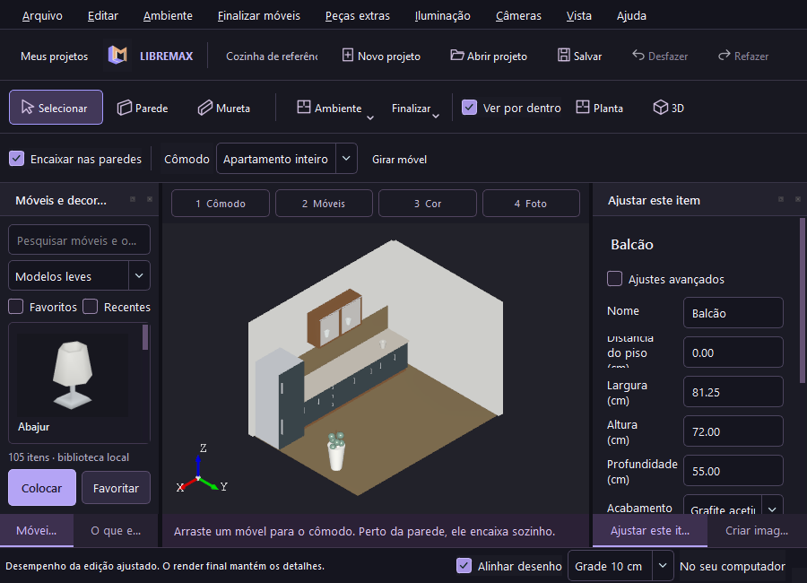
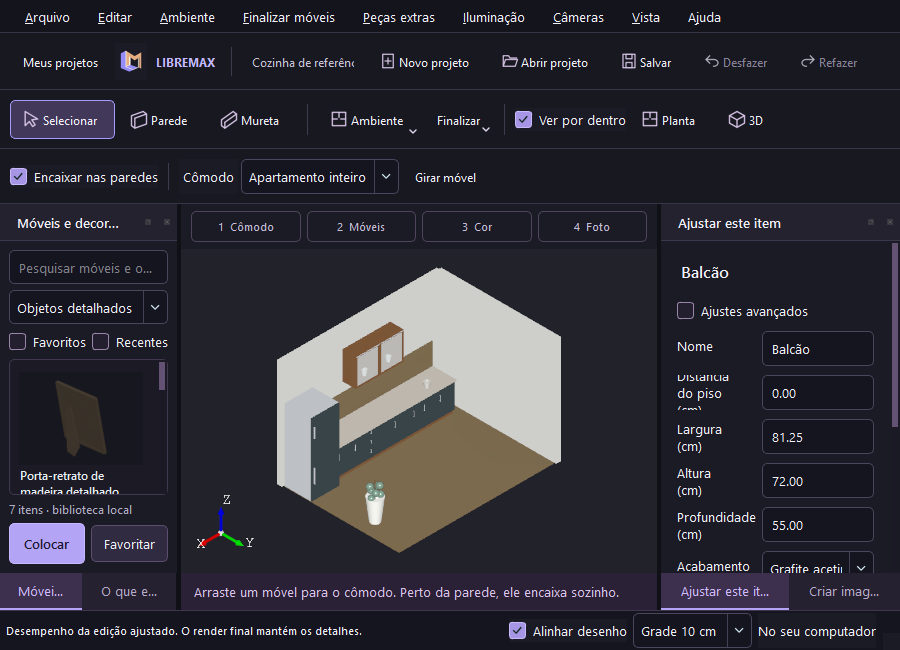

# Mais modelos e computadores de diferentes capacidades — 0.9

O catálogo local passa de 115 para **175 itens**, com **148 modelos 3D prontos** e 27 receitas paramétricas. São 60 novos modelos: 53 KayKit estilizados e sete Poly Haven com texturas. Todos acompanham o aplicativo; escolher um modelo não baixa arquivos nem exige Blender. O projeto incorpora as malhas e texturas utilizadas, permitindo abrir e renderizar sem a biblioteca original.

## Bibliotecas pesquisadas

| Fonte oficial | Licença verificada | Uso nesta entrega |
|---|---|---|
| [Kenney Furniture Kit](https://kenney.nl/assets/furniture-kit) | CC0 | Mantidos os 52 modelos existentes; o pacote oficial anuncia 140 arquivos/modelos |
| [KayKit Furniture Bits](https://github.com/KayKit-Game-Assets/KayKit-Furniture-Bits-1.0) | CC0 | Integrados os 53 glTF do repositório oficial na revisão `96d5930a8dbdb363409bbc2d3341718b00e17c9c` |
| [Poly Haven](https://polyhaven.com/models), [licença](https://polyhaven.com/license) | CC0 | 24 modelos anteriores e sete adicionais: vasos, relógios, tigelas e porta-retrato |
| [Quaternius Furniture Pack](https://quaternius.com/packs/furniture.html) | CC0 | Pesquisado, 23 modelos anunciados; não incorporado nesta entrega |
| [ambientCG](https://docs.ambientcg.com/license/) | CC0 | Pesquisado como fonte de materiais e assets; não incorporado nesta entrega |

As bibliotecas pesquisadas e os assets efetivamente incluídos são distinguidos na tabela. A seleção não inclui modelos proprietários do VDMax. [Licença KayKit distribuída](../starter-models/KAYKIT_LICENSE.txt), [catálogo](../starter-models/expanded-catalog.json) e [autores, URLs e hashes](../starter-models/expanded-provenance.json).

Os modelos KayKit têm de 44 a 1.018 triângulos nesta preparação, preservam UVs, normais e a paleta original em mapas de até 512 pixels. São estilizados: sua finalidade é variedade e geometria leve, sem apresentar aparência de fotografia de produto. As medidas são sugestões para apartamentos, com os limites originais também registrados. Prateleiras e quadros acompanham paredes; livros, almofadas, pequenos cactos e abajures acompanham superfícies; tapetes ficam no piso. Luminárias decorativas precisam de uma fonte de luz adicionada separadamente.

A ampliação acrescenta cerca de **10,1 MB de arquivos preparados**, antes da compressão do instalador. Esses arquivos ficam no disco; a consulta do catálogo usa metadados, e as malhas são carregadas ao preparar a miniatura ou inserir o item. O cache de payload continua limitado a 48 MiB. A preparação é reproduzível com `scripts/prepare-expanded-models.py`; requer NumPy, Pillow, curl e a revisão KayKit indicada. O aplicativo não precisa dessas ferramentas.

## Como escolher no aplicativo

Na biblioteca, use **Modelos leves** para os 105 modelos Kenney/KayKit, **Apartamento atual** para os 36 modelos contemporâneos anteriores ou **Objetos detalhados** para os sete novos Poly Haven. A busca por nome e por KayKit funciona com o banco SQLite/FTS. Os IDs e projetos existentes são preservados.

No menu **Vista → Desempenho durante edição**, escolha:

| Modo | Texturas na vista | Suavização solicitada | Workers de miniaturas |
|---|---|---|---|
| Leve — computador mais lento | Cores médias, sem mapas de imagem | Desligada | 1 |
| Equilibrado | Ativadas | 4 amostras | 2 |
| Mais detalhes | Ativadas | 8 amostras, conforme o driver | 4 |

A aproximação de curvas CAD também varia com o modo. As malhas importadas mantêm sua geometria. O modo é uma preferência local persistente: não altera medidas, texturas incorporadas, materiais ou a malha exportada para Cycles. A foto final conserva os detalhes. Para testar uma foto em computadores mais lentos, comece pelo preset Rápido e escolha CPU quando a GPU não for compatível.

Uma correção adicional atualiza somente a linha da miniatura concluída. Antes, cada conclusão percorria e recalculava todas as miniaturas do catálogo. A geração continua fora da thread da interface.

## Evidência e limites

Windows Release: **35 testes / 2.191 verificações** passaram. O novo teste usa todos os 60 assets reais, verifica malhas, UVs/texturas, miniaturas, incorporação por hash, salvamento e reabertura independente da biblioteca. A interface nativa verificou 175 miniaturas, os filtros, os três modos e a igualdade do documento e da malha de render antes/depois. Sofá KayKit no piso e relógio detalhado na parede passaram pela colocação nativa e reabertura do projeto. Montagem, coleção moderna e tutorial também passaram.

Um processo de teste foi limitado a **dois núcleos lógicos** pelo Windows. O smoke nativo passou em 19,14 segundos, incluindo abertura, miniaturas, edição, salvamento e os três modos. A construção da janela mediu 415 ms nesse caso. A GPU permaneceu RX 7600; esse ensaio não representa um computador antigo completo, uma GPU integrada ou pouca RAM. Os tempos não são benchmark de FPS nem comparação com VDMax.

Os pacotes continuam sendo Windows x86-64 e Ubuntu 24.04 amd64, com Mint 22 como alvo pela mesma base. Não há pacote macOS, ARM ou 32 bits nesta entrega. O viewport depende de OpenGL e de um driver funcional; o modo Leve não elimina essa necessidade. CPU no Cycles cobre GPUs sem backend de render compatível, mas continua exigindo uma versão do Blender compatível com o processador e o sistema. RAM, número de objetos e resolução afetam o desempenho. **Compatibilidade com todos os computadores não está comprovada.** GPUs integradas, máquinas antigas, pouca RAM, grandes apartamentos e renders Final/4K ainda precisam de testes físicos.

A [CI Linux 0.9](https://github.com/Pepeu2010/libremax-architect/actions/runs/37121303969) passou com interface Mesa/Xvfb, encaixe dos modelos novos, três modos, pacote Debian e render Cycles CPU/fila/HDRI/EXR. A [CI dos instaladores 0.9](https://github.com/Pepeu2010/libremax-architect/actions/runs/37121304063) passou: Windows com PATH sem SDK e todos os 148 modelos empacotados; Ubuntu em runner novo com biblioteca completa, interface, três modos, encaixe e desinstalação preservando projetos. No host Windows, os recursos empacotados também passaram em UI/modelos/tutorial com PATH sem SDK. Publicação dos downloads em preparação. [Instaladores publicados](../INSTALADOR/README.md).
