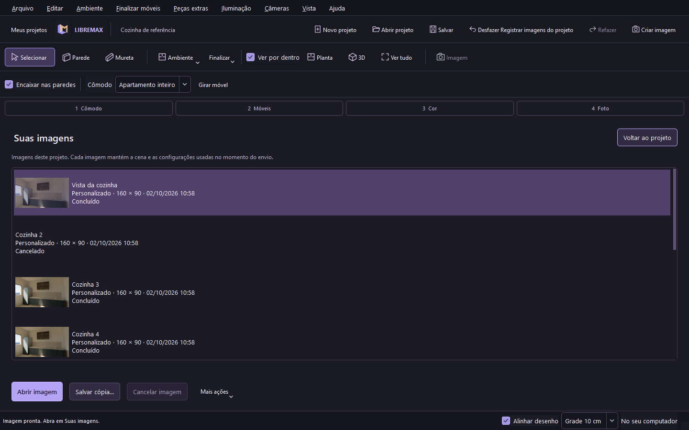

# Fila e galeria de renders — fontes 0.10.0

O LibreMax conserva o editor nativo Qt/OpenCASCADE. O Blender Cycles calcula as imagens em um processo independente, sem janela ou terminal. Não é necessário importar a cena nem configurar o projeto no Blender. Esta prévia ainda exige que o Blender 5.2 LTS ou superior esteja instalado; o aplicativo procura o executável no PATH e nas instalações Windows e permite selecioná-lo quando necessário.

## Fluxo disponível

1. Prepare a câmera, iluminação e acabamentos no LibreMax.
2. Escolha Rápido, Normal, Final ou Personalizado no painel Criar imagem.
3. Crie uma imagem, uma prévia rápida ou imagens de todas as câmeras.
4. Acompanhe a fila em Suas imagens. Voltar ao projeto permite continuar editando.
5. Abra o resultado, ajuste o zoom, salve uma cópia ou repita usando a cena original. Tentar com CPU cria um novo pedido preservando o histórico anterior.

Cada pedido mantém sua própria cópia do documento, materiais, assets e câmera. Alterações posteriores não modificam imagens já enviadas. Apenas um processo Cycles renderiza por vez, na ordem de envio. A preparação usa até dois workers; a tesselação também ocorre fora da thread da interface.

Os scripts confiáveis `cycles_render.py` e `cycles_lights.py` acompanham cada pedido novo. Repetir o render usa essa cópia, incluindo o tradutor Kelvin/LED/sol, e preserva a cena original. Pedidos anteriores que usavam um script único continuam repetíveis.

## Modos e arquivos

| Modo | Amostras | Reflexões máximas | Tamanho inicial |
|---|---:|---:|---|
| Rápido | 32 | 4 | 640 × 360 |
| Normal | 128 | 8 | 1920 × 1080 |
| Final | 512 | 12 | 1920 × 1080 |
| Personalizado | Ajustável, 1–4096 | Ajustável, 0–64 | Ajustável, 16–8192 pixels por eixo |

Os três presets ativam denoise. Personalizado permite alterar reflexões de luz indireta, reflexos, vidro e transparência, clamp, limiar de ruído e denoise. Os tamanhos predefinidos incluem paisagem, retrato, quadrado e A4. PNG e JPEG são suportados; Personalizado também oferece EXR float de 32 bits com prévia integrada. Fundo transparente preserva PNG/EXR e troca JPEG por PNG. [HDRI/EXR](HDRI_EXR.md). JPEG desativa transparência.

As configurações e metadados das imagens concluídas ficam no projeto `.lmx`. Imagens, cópias usadas para repetir o render e logs ficam na pasta de dados local do aplicativo, em `renders/<UUID>`. O `.lmx` não incorpora a galeria completa: mover o projeto para outro computador preserva a cena e os metadados, mas as imagens devem ser copiadas separadamente.

A galeria persiste ao reabrir o programa. Pedidos interrompidos são identificados e podem ser repetidos; não reiniciam automaticamente. Há limites de 20 pedidos aguardando e 500 registros. Excluir uma imagem remove o resultado e a linha da galeria, preservando cópia e logs para diagnóstico; uma política de limpeza desse armazenamento ainda está pendente.

## Arquitetura implementada

`RenderSnapshot` copia e valida o documento e os parâmetros. `RenderQueue` mantém registros JSON atômicos e ordem FIFO. `RenderSceneExporter` exporta a malha e os assets do snapshot em um worker. `RenderJob` coordena exportação, progresso e validação da saída. `BlenderBridge` é o único responsável pelo QProcess. `RenderGallery` apresenta os resultados na interface.

Blender recebe argumentos separados, sem shell. O script Python é um recurso distribuído, não é montado com texto do usuário. O processo recebe prioridade reduzida e até oito threads CPU. No Windows, um Job Object interrompe os processos associados ao fechar o aplicativo; no Linux, o processo recebe um sinal quando o pai termina. Cancelar também interrompe o processo ativo.

Estados distinguem preparação, exportação, render, denoise, salvamento, conclusão, falha, cancelamento e interrupção. Percentuais usam contagens de amostras emitidas pelo Cycles. Quando não há contagem, a interface mostra atividade indeterminada. O tempo transcorrido nunca inventa percentual. Os registros guardam a versão Blender, dispositivo, parâmetros e código de saída.

Uma imagem só substitui a saída depois de validar o arquivo e sua resolução. A cópia final usa QSaveFile; falha de processo ou imagem inválida preserva o resultado anterior. AUTO procura OptiX, CUDA, HIP e oneAPI; a seleção de dispositivo e a repetição após erro podem recorrer à CPU. A seleção HIP e um render real de apartamento foram validados na RX 7600 deste host Windows. NVIDIA/Intel, outras GPUs e HIP no Linux ainda não foram validados. A seleção usa apenas dispositivos do backend correspondente; a lista do Blender pode incluir dispositivos de outros backends.



[Galeria em janela de 900 pixels](screenshots/render-gallery-900.png). Capturas do teste de integração, com imagens pequenas para validar o fluxo.

## Evidência e limites

O teste `--queue-smoke` usa Blender/Cycles real, cinco câmeras, imagens de 160 × 90 e oito amostras CPU. Verifica ordem FIFO, cancelamento na fila e durante o render, falha de processo, repetição com CPU, progresso de amostras, edição sem alterar snapshots, reabertura do histórico, salvamento do projeto editado e galeria em janelas de 1440 e 900 pixels. A falha intencional é um caso negativo; as imagens positivas são calculadas pelo script de produção.

`--render-smoke` verifica imagem válida e preservação da imagem anterior após falha. Os testes do núcleo cobrem presets, parâmetros inválidos, snapshots e recuperação de registros interrompidos/corrompidos. A [CI Linux](https://github.com/Pepeu2010/libremax-architect/actions/runs/37018691178) passou com a fila, Blender oficial 5.2.1 e SHA256 conferido antes de extrair. Os instaladores continuam passando pelos testes de instalação, plugins, modelos, salvamento/reabertura e desinstalação.

Kelvin, LED contínuo, sol e os controles adicionais de área/ponto/spot estão integrados na fonte 0.10. O smoke nativo produz sete imagens reais e compara LED ligado/desligado e quente/frio. [Evidência e limites de iluminação](LIGHTING.md).

Esta entrega não completa toda a especificação de render. Permanecem pendentes: desfoque opcional de HDRI; canais adicionais de metalicidade, opacidade e emissão por mapa; validação exata de enquadramento entre viewport e Cycles; instâncias e tesselação própria de apresentação; políticas de cache; diagnóstico dedicado de versões/dispositivos; render Final em 4K; benchmarks de apartamentos grandes e QA com outras GPUs NVIDIA/AMD/Intel, incluindo HIP no Linux. O catálogo e a iluminação também condicionam o realismo. Não há comprovação de superioridade geral sobre o VDMax.


## Reproduzir a verificação HIP no Windows

Foi gerada uma imagem real do apartamento moderno, 640 × 360/32 amostras e denoise, por QProcess/BlenderBridge. O registro do motor confirmou `device=GPU`, `backend=HIP`, `AMD Radeon RX 7600`, Blender 5.2.1 LTS; não houve fallback CPU. Uma falha de câmera posterior preservou o hash da imagem. Driver do host: 32.0.32015.2008. Essa prévia pequena não é um benchmark de 4K.

```powershell
./build-render/libremax-architect.exe --render-smoke build-render/gpu-evidence --blender 'C:/Program Files/Blender Foundation/Blender 5.2/blender.exe' --render-device AUTO --expect-render-gpu --render-size 640x360 --render-samples 32 --render-project examples/apartamento-moderno.lmx
```

`--expect-render-gpu` falha se o resultado recorrer à CPU. Sem essa opção, CPU continua sendo um fallback permitido. O teste padrão usa CPU. [Imagem HIP calculada neste host](screenshots/hip-apartment-render.png).
