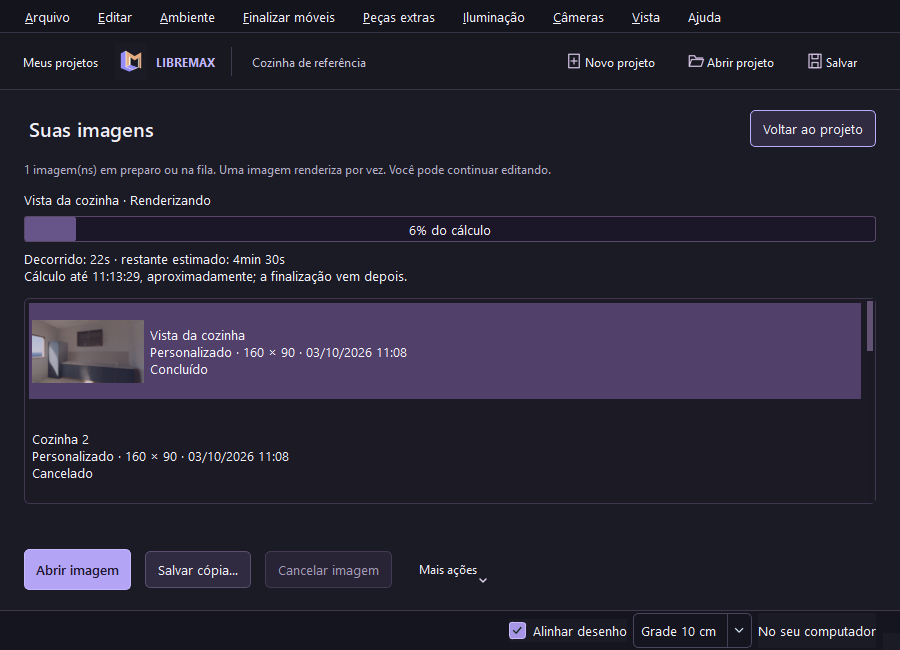

# Progresso e estimativa de render — 0.11

Ao criar uma imagem, **Suas imagens** mostra a barra do render ativo, nome da câmera e etapa. A barra permanece visível mesmo quando outra imagem da lista está selecionada. Se voltar ao projeto, o painel **Criar imagem** apresenta o mesmo progresso e os mesmos tempos.

- **Decorrido:** tempo desde o início da execução desse pedido, incluindo preparação da malha, cálculo e finalização. Espera na fila não entra nesse contador.
- **Restante estimado:** previsão informada pelo Cycles, atualizada durante o cálculo. O relógio diminui entre atualizações e corrige a previsão quando o motor envia outro valor.
- **Cálculo até:** horário aproximado de término do cálculo. Denoise, validação e salvamento vêm depois; esse horário não é promessa de arquivo pronto.
- **Tempo em execução:** duração registrada quando a imagem termina, falha ou é cancelada. O histórico preserva esse tempo após reabrir o aplicativo. Imagens antigas sem duração mostram “Tempo não registrado”.

A preparação começa com barra em atividade e “calculando estimativa”. Se o motor não informar previsão, se a última leitura tiver mais de 30 segundos ou se o prazo já tiver passado, a interface volta a “calculando estimativa”. A finalização identifica sua etapa, sem mostrar um falso zero de tempo restante. Imagens aguardando na fila não recebem uma previsão inventada.

O percentual corresponde às amostras e partes de imagem concluídas pelo motor. Em imagens divididas em partes, acabar a primeira parte não significa acabar a imagem. A barra não recua na troca de parte; chega no máximo a 99% antes de validar e salvar o resultado. **100% aparece somente após concluir a saída válida.** Se a GPU falhar e o motor reiniciar com CPU, progresso e previsão reiniciam para a nova tentativa.

O Cycles é executado em outro processo. A estatística vem do handler nativo [`bpy.app.handlers.render_stats`](https://docs.blender.org/api/5.2/bpy.app.handlers.html), preservada em `LIBREMAX_STATS`; a previsão é lida do campo `Remaining` que o Blender 5.2.1 deste projeto emite. Não se calcula percentual a partir do tempo decorrido.

O relógio usa tempo monotônico, atualizado uma vez por segundo. O heartbeat atualiza somente os controles de tempo, sem reconstruir a lista de imagens nem escrever no disco a cada segundo. Etapas, estatísticas e término persistem a duração no histórico. O projeto e a imagem anterior continuam preservados nos casos de falha já cobertos pelo pipeline.

## Verificação

Os testes de núcleo cobrem transições de partes baseadas nas estatísticas do render 4K anterior, amostras finais, tempos com horas/milissegundos, valores inválidos, previsão ausente/vencida e duração congelada. O teste nativo `--queue-smoke` usa Cycles real: verifica a barra e os tempos durante um render CPU, evolução do relógio, layout em 1440 e 900 pixels, cancelamento e persistência da duração de imagens concluídas. A estimativa continua sendo aproximada: carga do computador, GPU/CPU, complexidade da cena e amostragem adaptativa podem alterá-la.

Windows Release: **40 testes / 2.269 verificações** passaram. O teste nativo calculou quatro imagens reais, verificou progresso de 6% com previsão positiva durante outro pedido, contador avançando, duração persistida após reabrir, cancelamento e retorno ao editor com as ferramentas restauradas. As duas linhas de tempo e a barra ficaram visíveis em 1440 × 900 e 900 × 650.

[Captura em 1440 pixels](screenshots/render-progress.png). A [CI Linux](https://github.com/Pepeu2010/libremax-architect/actions/runs/37129048387) passou com Cycles real e o mesmo teste de barra, estimativa e layout. A [CI dos instaladores](https://github.com/Pepeu2010/libremax-architect/actions/runs/37129048284) passou em Windows e Ubuntu instalado em runner novo. A [prévia 0.11](https://github.com/Pepeu2010/libremax-architect/releases/tag/v0.11.0-preview.1) está publicada. [Relatório](TEST_REPORT.md), [fila e galeria](RENDER_PIPELINE.md).
